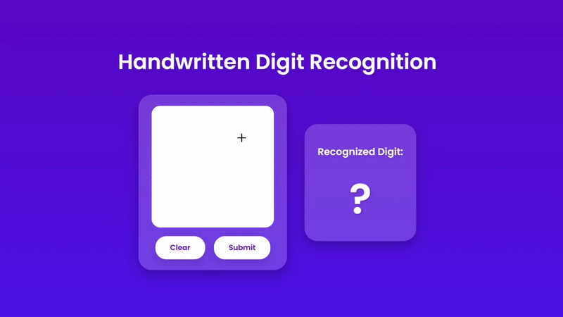

# Handwritten Digit Recognizer

This is a web app that uses a Convolutional Neural Network (CNN) to recognize handwritten digits drawn on a canvas.

## Demo



## Features
- Draw digits with your mouse or touchscreen
- Real-time digit prediction powered by TensorFlow
- Clean, mobile-friendly interface
- Trained on the MNIST dataset

## Tech Stack
- Python + Flask (Backend)
- TensorFlow (Machine Learning)
- HTML + CSS + JavaScript (Frontend)

## How to Run It

1. Clone the repo:
   ```bash
   git clone https://github.com/stephaniebittner802/handwritten-digit-recognizer.git
   cd handwritten-digit-recognizer
   ```

2. Create and activate a virtual environment:
   ```
   python3.10 -m venv tf-env
   source tf-env/bin/activate
   ```

3. Install dependencies:
   ```
   pip install -r requirements.txt
   ```

4. Train the model:
   ```
   python train_model.py
   ```

5. Start the Flask app:
   ```
   python app.py
   ```

6. Open your browser at:
   ```
   http://localhost:5000
   ```

## Project Structure

```
digit_recognizer/
├── assets/
│   └── demo.gif
├── static/
│   ├── script.js
│   └── style.css
├── templates/
│   └── index.html
├── app.py
├── digit_model.h5
├── README.md
├── requirements.txt
└── train_model.py
```

## License
MIT License
